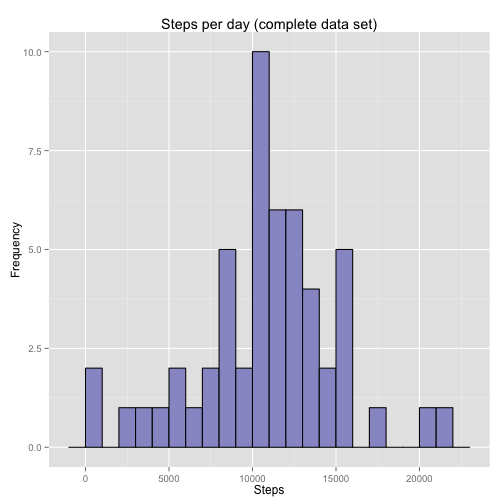

Peer Assesment Project 1 - Reproducible Research [Coursera repdata-016]
===================================
Carlos E. Martinez-Torteya - December 12, 2014
-----------------------------------------------

### Introduction

In this project we will use data collected from a personal monitoring device that collected the number of steps taken in 5-minute intervals each day for a two month period.

First, we load the data set and take a quick look at its contents:


```r
library(ggplot2)
rawdata <- read.csv("activity.csv")
head(rawdata)
```

```
##   steps       date interval
## 1    NA 2012-10-01        0
## 2    NA 2012-10-01        5
## 3    NA 2012-10-01       10
## 4    NA 2012-10-01       15
## 5    NA 2012-10-01       20
## 6    NA 2012-10-01       25
```

It is immediately clear that the raw data set contains some NA's. For the first part of the project, we will work with only the non-NA data:


```r
completedata <- rawdata[complete.cases(rawdata),]
str(completedata)
```

```
## 'data.frame':	15264 obs. of  3 variables:
##  $ steps   : int  0 0 0 0 0 0 0 0 0 0 ...
##  $ date    : Factor w/ 61 levels "2012-10-01","2012-10-02",..: 2 2 2 2 2 2 2 2 2 2 ...
##  $ interval: int  0 5 10 15 20 25 30 35 40 45 ...
```

As the dates were read as _factors_, and we will be using dates for subsetting and plotting, we should convert the date values from _factors_ to _dates_. Also, we will convert the steps value from _integer_ to _numeric_ to avoid problems with calculations:


```r
completedata$date <- as.Date(as.character(completedata$date))
completedata$steps <- as.numeric(completedata$steps)
str(completedata)
```

```
## 'data.frame':	15264 obs. of  3 variables:
##  $ steps   : num  0 0 0 0 0 0 0 0 0 0 ...
##  $ date    : Date, format: "2012-10-02" "2012-10-02" ...
##  $ interval: int  0 5 10 15 20 25 30 35 40 45 ...
```

### What is mean total number of steps taken per day?

One can calculate the total number of steps taken each day in a number of different ways. Here, we will use _tapply_:


```r
datesums <- tapply(completedata$steps, completedata$date, sum)
```

With this, we can now create a histogram of total steps taken per day:


```r
df1 <- data.frame(steps=datesums)
h <- ggplot(df1, aes(x=steps)) + geom_histogram(bin=1000, fill="#9999CC", color="black") + ggtitle("Steps per day")+xlab("Steps")+ylab("Frequency")
plot(h)
```

 

Also, we can now quickly obtain the mean and median number of steps per day using _summary_, taking care to use an adequate value for the _digits_ option (number of significant figures used in calculations):

```r
round(summary(datesums, digits=7))
```

```
##    Min. 1st Qu.  Median    Mean 3rd Qu.    Max. 
##      41    8841   10765   10766   13294   21194
```

Or we could calculate them directly, using the _mean_ and _median_ functions:

```r
datesums_mean <- mean(datesums)
round(datesums_mean)
```

```
## [1] 10766
```

```r
datesums_median <- median(datesums)
round(datesums_median)
```

```
## [1] 10765
```

### What is the average daily activity pattern?

Now we follow a similar procedure, but summing steps over interval instead of date. First, we take a quick look at the _interval_ values:


```r
head(unique(completedata$interval), 20)
```

```
##  [1]   0   5  10  15  20  25  30  35  40  45  50  55 100 105 110 115 120
## [18] 125 130 135
```

Where we note that the interval contains the 5-minute span when the number of steps were counted (e.g. "50" stands for 00:50, "135" for 01:35, "1630" for 16:30, etc.).

Again, we will use _tapply_ to obtain the average number of steps taken during each interval, and take a look at a summary of it:


```r
intervalave <- tapply(completedata$steps, completedata$interval, mean, simplify = TRUE)
round(summary(intervalave, digits=7))
```

```
##    Min. 1st Qu.  Median    Mean 3rd Qu.    Max. 
##       0       2      34      37      53     206
```

Although technically we averaged over number of intervals, as all days contain equal number of intervals in the _completedata_ set (which will be shown explicitely in a later section), this is equivalent to averaging over number of days.

Now, we generate a time-series plot for number of steps Vs time interval.


```r
df2 <- data.frame(interval=unique(completedata$interval), ave_step=intervalave)
k <- ggplot(df2, aes(x=interval, y=ave_step)) + geom_line() + xlab("Interval") + ylab("Average Steps") + ggtitle("Daily Activity Pattern")
plot(k)
```

 

From the plot, it is clear that the maximum occurs sometime between 7AM and 9AM. We obtain the exact 5-minute interval when this occurs:


```r
which(intervalave == max(intervalave))
```

```
## 835 
## 104
```

So, _on average_ the 5-minute interval starting at **08:35AM** (the 104th interval in the dataset) was the one when the most steps were taken, with a daily average of 206 steps.

### Imputing missing values

As became apparent when we loaded the raw dataset, there are some missing values. First, we will see _how many_ there are:


```r
NAs <- !complete.cases(rawdata)   #Logical vector with rows where there are NAs
sum(NAs)
```

```
## [1] 2304
```

```r
sum(NAs)/dim(rawdata)[1]  #Percentage of NAs with respect to raw dataset
```

```
## [1] 0.1311475
```

About 13\% of the values are missing in the raw dataset. Whether that is an _acceptable_ value or not is outside the scope of this project.

We will now look at _how_ these missing values are distributed. We can start with how the NAs are distributed over days:


```r
NAdata <- rawdata[!complete.cases(rawdata),]  #Dataset with every row that has NAs
NAdatasums <- tapply(NAdata$steps, NAdata$date, length)
unique(NAdatasums) #List of number of different NAs per day
```

```
## 2012-10-01 2012-10-02 
##        288         NA
```

So either a day has 288 NAs, or none at all. And the _total_ amount of 5-minute intervals per day is precisely 288:


```r
(60/5)*24
```

```
## [1] 288
```

Thus, either a day has no NAs at all, or it has _only_ NAs. This happens for 8 days (2304/288 = 8) troughout the two-month period where the data was taken. We can look at which days are these:


```r
unique(NAdata$date)
```

```
## [1] 2012-10-01 2012-10-08 2012-11-01 2012-11-04 2012-11-09 2012-11-10
## [7] 2012-11-14 2012-11-30
## 61 Levels: 2012-10-01 2012-10-02 2012-10-03 2012-10-04 ... 2012-11-30
```

Because it would be impossible to subsitute the NAs for their daily average (as there is no average for days with NAs), we will substitute the NAs for their 5 minute-interval average:


```r
fulldata <- rawdata      #This method is not terribly efficient, it will take some time to process
fulldata$date <- as.Date(as.character(fulldata$date))
NAdates <- as.Date(as.character(unique(NAdata$date)))  #List of dates where NAs occur
intervalaverep <- rep(intervalave, 61)  #Vector of same length as fulldata set, with interval average values for each row
for (d in 1:length(NAdates)) {
     N <- grep(NAdates[d], fulldata$date)[1]    #Find row corresponding to first interval of d-th day with NAs
     for (i in N:(N+287)) {
          fulldata$steps[i] <- intervalaverep[i] #Replace NA value with interval-average value for all intervals in d-th day
     }
}
head(fulldata)
```

```
##       steps       date interval
## 1 1.7169811 2012-10-01        0
## 2 0.3396226 2012-10-01        5
## 3 0.1320755 2012-10-01       10
## 4 0.1509434 2012-10-01       15
## 5 0.0754717 2012-10-01       20
## 6 2.0943396 2012-10-01       25
```

```r
sum(!complete.cases(fulldata))  #Check if there are any NAs still left in the fulldata set
```

```
## [1] 0
```

So our _fulldata_ set has no NAs left.

### Are there differences in activity patterns between weekdays and weekends?

We start adding a factor column to the _fulldata_ set that takes values "weekday" and "weekend" (as _factors_) depending on the date it was taken.


```r
fulldata$work <- "weekday" 
for (i in 1:nrow(fulldata)){
     if (weekdays(fulldata$date[i]) >= "Saturday") {
          fulldata$work[i] <- "weekend"
     }
}
fulldata$work <- as.factor(fulldata$work)
str(fulldata)
```

```
## 'data.frame':	17568 obs. of  4 variables:
##  $ steps   : num  1.717 0.3396 0.1321 0.1509 0.0755 ...
##  $ date    : Date, format: "2012-10-01" "2012-10-01" ...
##  $ interval: int  0 5 10 15 20 25 30 35 40 45 ...
##  $ work    : Factor w/ 2 levels "weekday","weekend": 1 1 1 1 1 1 1 1 1 1 ...
```

Lastly, we construct plots for the daily average activity for weekdays and weekends. First, we obtain two separate lists containing the interval averages for weekdays and weekends:


```r
weintervalave <- tapply(subset(fulldata, work == "weekend")$steps, subset(fulldata, work == "weekend")$interval, mean, simplify = TRUE)  #List of 5-minute interval averages for weekend days
wdintervalave <- tapply(subset(fulldata, work == "weekday")$steps, subset(fulldata, work == "weekday")$interval, mean, simplify = TRUE)  #List of 5-minute interval averages for weekday days
```

Now we merge them into a single data frame with columns for average steps, interval, and weekday/weekend:


```r
df1 <- data.frame(average_steps = wdintervalave, interval = names(intervalave), work = "weekend" ) # data-frame for weekend days
df2 <- data.frame(average_steps = weintervalave, interval = names(intervalave), work = "weekday" ) # data-frame for weekday days
mergeddata <- rbind(df1,df2)
mergeddata$work <- as.factor(mergeddata$work) #Force the work column to be of class "factor"
mergeddata$interval <- as.integer(as.character(mergeddata$interval))
```

Finally, we construct the time-series panel plot for weekday and weekend average steps:


```r
p <- ggplot(mergeddata, aes(interval, average_steps))
p <- p + geom_line() + facet_grid(work ~.) + xlab("interval") + ylab("average steps") + ggtitle("Activity patterns")
print(p)
```

 

So, we can see that although there are indeed differences in the patterns of weekdays and weekends, they both peak at around the same time, and share similarities in the degree of activity during the evenings.
